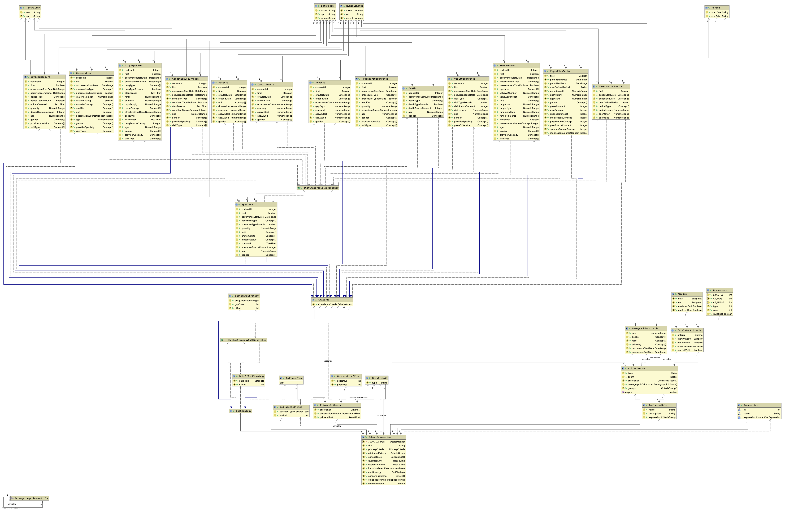

# Design Documentation

The ELM to OMOP translator takes CQL or ELM (parsed CQL) as input, and generates an OHDSI cohort definition as output.
The functionality also exists to submit the cohort definition to the OHDSI WebAPI to create the cohort definition,
initiate the cohort generation job, and poll for the cohort results.

As this is a [PhEMA](https://projectphema.org/) project, the ultimate goal of this work is to evaluate whether the CQL
language can be used for cross-platform EHR-driven phenotyping.

## Circe Overview

The library used internally by the OHDSI WebAPI to represent and execute cohort definitions is
[Circe](https://github.com/OHDSI/circe-be). The normal way that users create cohort definitions is by using the OHDSI
web interface, called [Atlas](https://github.com/OHDSI/Atlas). The user creates a list of inclusion rules by clicking
buttons and selecting from dropdown menus. To each inclusion rule they add criteria groups, and to each group they add
specific domain criteria by using standard user interface controls.

Once saved, the Atlas application generates a JSON representation of the cohort definition, which is then submitted to
the WebAPI, which saves it to the OHDSI database. The user must then take a separate action to initiate the cohort
generation job. As part of this asynchronous job, the Circe library deserializes the JSON version of the cohort
definition into Java objects that it uses internally. Circe then uses a set of [builder
classes](https://github.com/OHDSI/circe-be/tree/master/src/main/java/org/ohdsi/circe/cohortdefinition/builders), along
with SQL templates to construct the database queries needed to generate the cohort from the cohort definition.

There are several benefits to this approach. First, the graphical user interface allows users without any knowledge of
SQL, and only minimal knowledge of the OMOP Common Data Model (CDM) to construct cohorts of clinical and/or research
interest. Separation of logic into distinct inclusion rules allows for more efficient database queries, since successive
inclusion rules are only applied to the results of the previous rule. Separate inclusion rules further allow for the
generation of attrition statistics and visualizations. Finally, using SQL enables the creation of manually optimized
queries that may be better than those generated by an object-relational mapper.

The following Circe UML diagram shows how cohort expression are assembled, as well as what type of criteria exist.

| **Circe UML Diagram** |
| -------------------   |
| |

## CQL Overview

The [Clinical Quality Language (CQL)](https://cql.hl7.org/) is a domain-specific language focused on the clinical
quality and decision support domains. It is parsed into a canonical abstract syntax tree they call the Expression
Logical Model (ELM). [Libraries](https://mvnrepository.com/artifact/info.cqframework) exist to parse CQL into the
equivalent ELM representation, so internally all our computation is done on ELM.

CQL is a highly expressive language approaching the complexity of a general purpose programming language. As such, it is
able to represent significantly more constructs than Circe, as can be seen in the ELM UML diagram below. One simple
example is that CQL is able to evaluate the expression `1 + 1` and return the result of `2`. Furthermore, there are
usually many different ways that the same logic can be represented in CQL. CQL is also data model independent, which
means that libraries must specify the data that they are written for, and the evaluation engine must know about this
data model in order to evaluate to the library.

A CQL library can contain many statements, each of which is evaluated separately (although statements can reference each
other). This means that evaluating a CQL library returns multiple results - one for each statement in the library.
Further, each result can be one of many different [data types](https://cql.hl7.org/03-developersguide.html#types). 

| **ELM UML Diagram** |
| -------------------   |
| |

## Implementation Considerations

### Language Support

For the above reasons, we can only support translating a limited subset of the CQL language. We therefore define a set
of supported language constructs, along with some conventions that must be followed so that we can successfully
translate the CQL library to a Circe cohort definition. We aim to support the following language constructs:

- [x] The `CalculateAge()` function, used to determine the age of the patient [[docs](https://cql.hl7.org/02-authorsguide.html#patient-operators)]
- [x] Simple `Retrieve` operation with terminology filtering, to access the underlying data [[docs](https://cql.hl7.org/02-authorsguide.html#retrieve)]
- [x] The following numeric comparisons: `=`, `<`, `<=`, `>`, `>=` [[docs](https://cql.hl7.org/02-authorsguide.html#comparison-operators)]
- [ ] Some `Query` operations with `where` clause filtering [[docs](https://cql.hl7.org/02-authorsguide.html#filtering)]<sup>†</sup>
- [ ] Some correlated `Query` operations with a single relationship [[docs](https://cql.hl7.org/02-authorsguide.html#relationships)]<sup>†</sup>
- [ ] Timing relationships in `Query` constructs (including correlated queries) [[docs](https://cql.hl7.org/02-authorsguide.html#timing-relationships)]<sup>†</sup>
- [x] The `And` and `Or` logical operators [[docs](https://cql.hl7.org/02-authorsguide.html#timing-relationships)]

<sup>†</sup> The `Query` operations that we are able to support is limited by the criteria and criteria attributes that
Circe is able to represent.

More operations will be added to the above list over time, for example, additional demographic characteristics.

### Data Model

A simple approach would be to use the OMOP CDM as the data model in our CQL libraries, but this would limit the
environments in which the library can be executed. We have therefore taken the decision to use the [**QUICK** data
model](http://hl7.org/fhir/us/qicore/quick/QUICK-index.html), which is a set of FHIR profiles and data type mappings
that are focused on quality measurement and decision support use cases. It is likely that many CQL libraries will be
written using the **QUICK** data model, and supporting this data model means that we are able to re-use logic written
for many clinical quality measurement and decision support use cases.

In order to map the **QUICK** model references to the OMOP CDM, we use the
[mappings](http://build.fhir.org/ig/HL7/cdmh/profiles.html#omop-to-fhir-mappings) published by the Common Data Model
Harmonization project.

### Conventions

#### `Patient` Context Only

CQL libraries may contain zero or more `context` statements. This statement tells the interpreter to potentially apply
some data filtering. For example, if the `Patient` context is specified, then only data for a specific patient is
included in the evaluation. If the `Unfiltered` context is used, then data for all patients is considered. Data models
may optionally specify additional evaluation contexts
[[docs](https://cql.hl7.org/02-authorsguide.html#retrieve-context)].

We support only the `Patient` context, which means that each statement should be written with knowledge that it will be
applied to a single patient only. This also means that we cannot support the population-based aggregate operators
[[docs](https://cql.hl7.org/02-authorsguide.html#aggregate-operators)].

### Phenotype Entry Point Statement

Since a CQL library may contain multiple statements, but we only create one Circe cohort definition, we must somehow
determine which statement represents the phenotype definition. Currently, the translator is written in such a way that
it takes the name of the phenotype definition statement as a parameter. An alternative approach could be to use a
statement naming convention, or some other way to annotate the correct statement definition.

### Boolean Return Types

The ultimate decision that must be made for each patient is whether or not they should be included in the cohort
specified by the Circe cohort definition, or equivalent CQL library. In Circe, this decision is made by taking the
logical conjunction of each inclusion rule applied to each patient.

The approach we have taken is to require that all CQL statements return a boolean value. At first this may seem
limiting, but it actually exactly matches how Circe represents cohort definitions. Each Circe criteria determines exactly
the boolean result corresponding to whether or not a given patient meets the criteria.

### Implementation Details

Some technical implementation details are described below. 

### Inclusion Rules

When users create cohort definitions using Atlas, it is convenient to group conceptually similar criteria together in a
single inclusion rule. One example is that two demographic criteria, such as one for age and for gender may both be
added to one inclusion rule. Without introducing additional conventions, it is unfortunately not possible to detect
these conceptually similar criteria in the translator code. As a result, all criteria are added to a single inclusion
rule.

There are two unfortunately consequences. First, it not possible to determine the attrition contribution from groups
of criteria. Second, this limitation may result in poorer performing database queries, since criteria are not applied
only to the results of preceding inclusion rules.

It may be worth introducing additional conventions to overcome these limitations.

#### 🤯 Criteria Groups, Correlated Criteria, and Criteria

In Circe, criteria groups are used to group collections of criteria together. Criteria groups must also specify how the
contained criteria should apply. For example, the user can specify whether _all_ criteria must apply, whether _any_ one
can apply, or a whether minimum or maximum number of criteria must apply.

Criteria themselves can be correlated or uncorrelated. For example, looking for a condition that matches a specific
value set is an uncorrelated criteria. Looking for a measurement with a specific value that occurs within some
time frame of a specific procedure is an example of a correlated criteria.

Unfortunately, in version `1.7.0` of the Circe library, criteria groups can only contain instances of the
`CorelatedCriteria` class (or `DemographicCriteria` or other `CriteriaGroup`s). This means that specific domain criteria
(e.g. `ProcedureOccurrence`) must always be wrapped in a `CorelatedCriteria`, even when uncorrelated. Further, the
`Criteria` parent class of all domain criteria has a field called `CorelatedCriteria`, which is actually of type
`CriteriaGroup`, which can be very confusing. However, this field _does_ determine which criteria groups are correlated
to the specific domain criteria instance.

Consider the very simple case of a cohort definition where we are only looking for patients that have had a procedure
matching a specific value set. To accomplish this, we would create a `CohortDefinition` instance, to which we would add
a `CohortExpression` containing a single `InclusionRule`. The `InclusionRule` class contains a single `expression`
member that is of type `CriteriaGroup`.

To construct the logic, we begin by creating an instance of the `ProcedureOccurrence` criteria referencing the
appropriate value set (more on value sets below). We leave the `CorelatedCriteria` field (note: this is the name of the
field, not its type, which is unfortunately actually `CriteriaGroup`) `null`, since this is an uncorrelated criteria.

We must then create a `CorelatedCriteria`, and set the `criteria` field to the `ProcedureOccurrence` instance just created.
Finally, we can add this `CorelatedCriteria` to a `CriteriaGroup`, which we can then add to the `InclusionRule`. We end
up with something that looks like the following:

```
• CohortExpression
   • CohortExpression
      • List<InclusionRule>
         - 0: CriteriaGroup
               • List<CorelatedCriteria>
                  - 0: CorelatedCriteria
                        • ProcedureOccurrence
                           • CriteriaGroup = null (name: CorelatedCriteria, type: CriteriaGroup)                                
```

One reason why all `Criteria` must be wrapped in a `CorelatedCriteria` is because cohorts in OHDSI are modeled using the
idea of cohort entry event, and all criteria are actually correlated in some way to this entry event, either directly or
indirectly. The `CorelatedCriteria` class therefore has `startWindow` and `endWindow` fields, which are relative
(directly or indirectly) to the entry event.

Finally, `CorelatedCriteria` also has an `occurence` field of type `Occurence`, which is used to describe how domain
criteria should apply. Continuing the above example, if the procedure should occur at least three times, then we specify
this using an `Occurence` instance.

Note that in all cases except for Boolean logic (see below), we translate CQL constructs to their equivalent
`CorelatedCriteria` representations.

Below is a table with a short summary of some of the important Circe classes.

| **Class** | Description |
| --------- | ----------- |
| `CohortDefinition` | This is actually a class in the WebAPI, not Circe, but it is the outer most wrapper of the payload that is sent to the WebAPI. |
| `CohortExpression` | This class is the container for the expression logic, including the `InclusionRule` instances, and the cohort entry event (an instance of  `PrimaryCriteria`). |
| `InclusionRule` | An inclusion rule just wraps a single `CriteriaGroup`, giving it a name. |
| `CriteriaGroup` | A criteria group contains any number of `CorelatedCriteria`, `DemographicCriteria` and/or other `CriteriaGroup` instances. It also specifies how these criteria are applied (e.g. `ALL`, `ANY`, `AT_LEAST 3`, etc). |
| `CorelatedCriteria` | This class wraps all domain criteria, and associates start and end windows with them (relative to the parent criteria or entry event). This class also has an `Occurence` field specifying how many, say, procedures should be found. |
| `Criteria` | This abstract class is the parent of all the domain criteria (e.g. `ConditionOccurrence`, `Observation`, etc). `Criteria` also contains a field (unfortunately) called `CorelatedCriteria` of _type_ `CriteriaGroup` which facilitates temporal correlation between criteria. |
| `DemographicCriteria` | This is a special type of criteria allowing the user to filter cohort members based on demographic characteristics. |
 
#### Nested Boolean Logic  

Boolean logic can only be represented in Circe using `CriteriaGroup` instances of type `ALL` and `ANY`, representing
Boolean `AND` and `OR` statements respectively. We support arbitrarily nested Boolean `AND` and `OR` statements, and
implement such nesting using nested `CriteriaGroup` instances.

### Value Sets

Circe uses the `ConceptSet` class to represent value sets. All referenced value sets are included inline in the
`CohortExpression` instance. I believe this is so that descendents, mapped, and excluded concepts specified in existing
OHDSI concept sets can all be resolved ahead of evaluating the cohort expression.

That said, our implementation does not make use of existing concept sets. Instead, we define a service interface used to
retrieve the relevant concepts sets. We have service implementations that read PhEMA value sets from CSV files, and
resolve concepts using the OHDSI WebAPI. This supports using publicly accessible value sets based on standard
terminologies, and decouples the implementation from the OHDSI platform.

We also have a service implementation that reads pre-resolved concept sets from file in JSON format. This is more
efficient, especially for large concept sets, since concepts must otherwise be resolved one at a time by performing a
search using the WebAPI, which is an expensive operation.

### Alternative Approaches

The approach described above is not the only possibility. Another approach would be to extend the reference
implementation of the CQL engine (or create a new implementation) to directly support the OMOP CDM as a data model. The
advantage of this approach is that the CQL library author would have full access to the expressiveness of the CQL
language, and could write queries of any type, for any purpose, not just phenotyping.

The downside of this approach is that CQL libraries written against this data model would then be tied to the OHDSI
platform, and would not be cross-platform, as in the currently implementation. Further, the full set of OHDSI tools for
cohort analysis would no longer be available to the user. Importantly, in the current approach, a user can look at the
generated cohort definition in the existing Atlas interface to manually inspect whether or not the logic is correct,
which would not be possible in a pure CQL data provider implementation.


